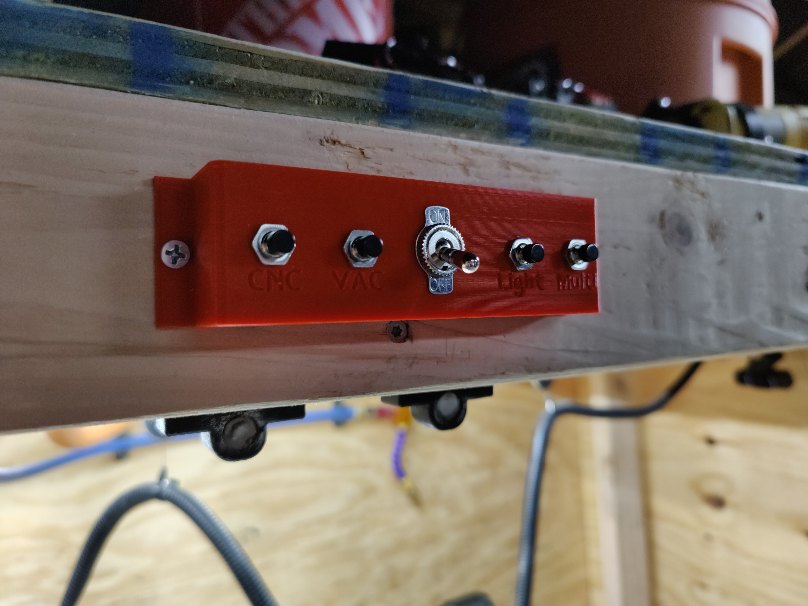

# MPCNC Button Board
Raspberry Pi button board to send a command to Home Assistant or Octoprint from your CNC enclosure.



## Install
* Install the following packages 
  ```
  python3
  python3-rpi.gpio  
  python3-gpiozero 
  ```
* Clone the repository to a local directory
* Rename the `.env.example` file to `.env` and configure the variables
* Run `python3 -m venv ./venv`
* Run `./venv/bin/python3 -m pip install -r requirements.txt`
* Set a cronjob to start this script on bootup of your Raspberry Pi


## Pins
| Button       | Pin  | Wire Color |
|--------------|------|------------|
| CNC          | 21   | Blue       |
| VAC          | 20   | Purple     |
| Lights       | 19   | Red        |
| Multi        | 16   | Orange     |
| 10K Resistor | Signal / Ground | Yellow |
| 3.3V         | 3.3v | Brown      |

